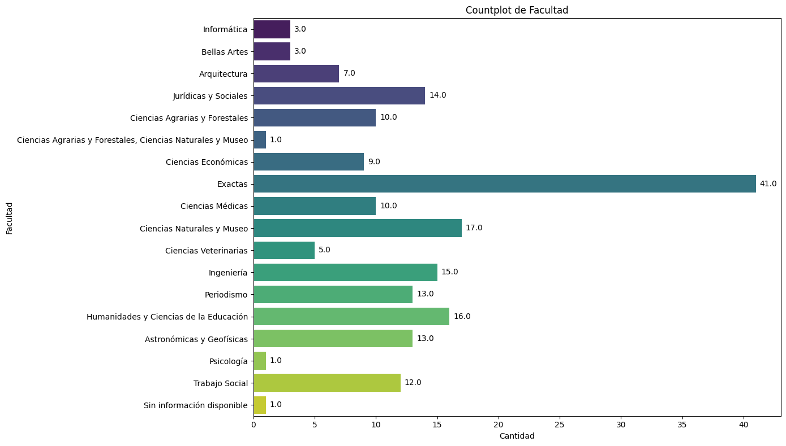
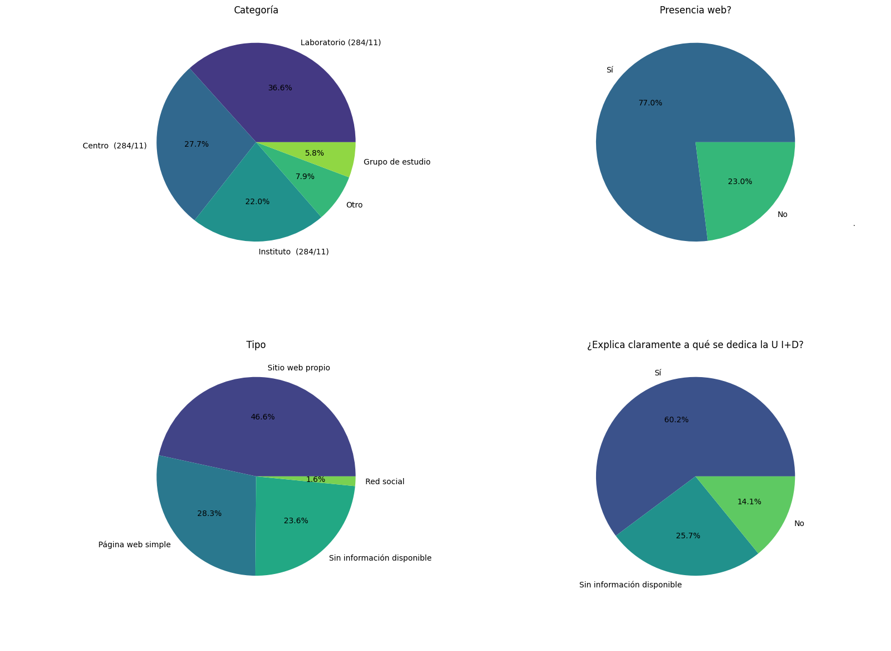
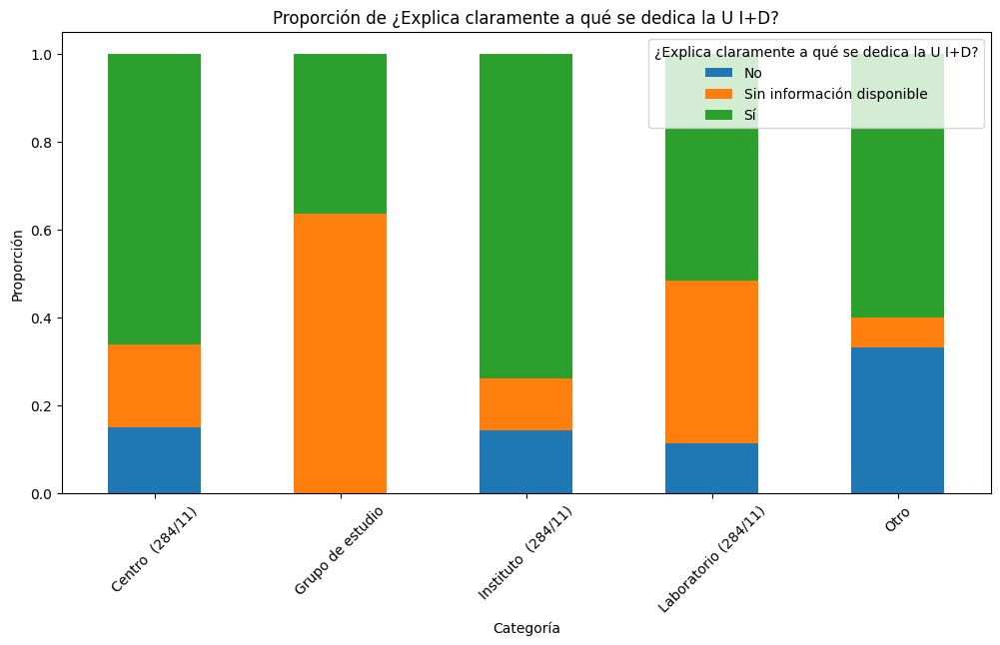
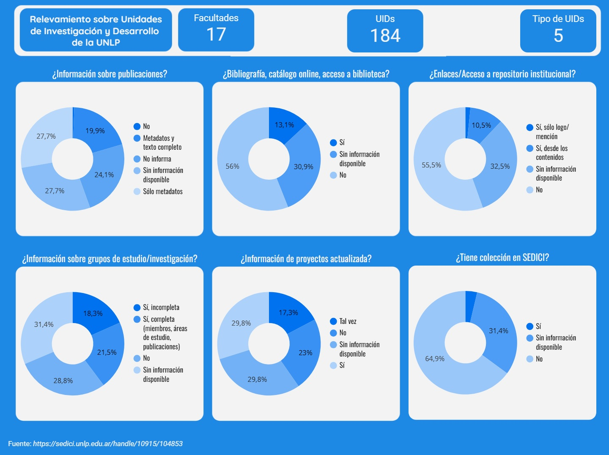

## Introducción

El presente proyecto consta de un EDA (Exploratory Data Analysis) realizado con Python y la librería Pandas para la carga de datos en un Dataframe y su consecuente análisis, así como visualizaciones de los datos y sus relaciones por medio de las librerías Matplotlib y Seaborn.
Además, realicé un Dashboard interactivo con visualizaciones de todas las variables en LookerStudio, al cual se puede acceder desde <a href="https://lookerstudio.google.com/s/lXLnJXsKqjk" target="_blank">aquí</a>.

## Descripción de los datos

El dataset es un relevamiento de datos sobre las distintas unidades de investigación y desarrollo (UID) de la Universidad Nacional de La Plata, con vistas a dar mayor visibilidad a la producción científica de esta casa de estudios. El mismo fue realizado por Maitini, José; Villarreal, Gonzalo Luján; Vila, María Marta; Manzur, Ezequiel; De Giusti, Marisa R. Fuente: http://sedici.unlp.edu.ar/handle/10915/104853

## Tecnologías Utilizadas

- Python
- Jupyter Notebook
- Pandas
- Matplotlib
- Seaborn
- Looker Studio

## Capturas de pantalla

### Algunas visualiciones del EDA

### Captura del dashboard

